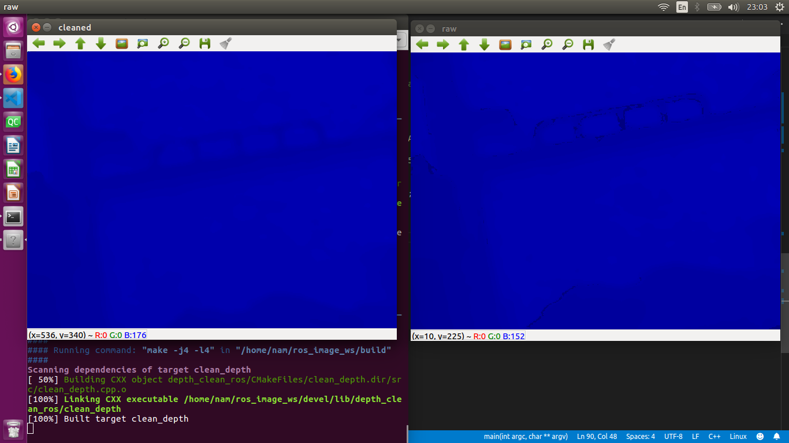

# Depth Cleaned Realsense using ROS and OpenCV

Using OpenCV API for clean depth. But it has some mistake that need to improve:
* Very slow. So that, it can't using for next step.
* I don't know why but it need a lot of time for show correct output.
### To do
I think queue and multi thread can solve them.
