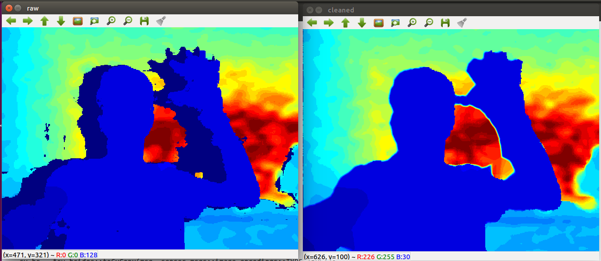

# Depth Cleaned Realsense using ROS and OpenCV

*Left: raw depth map; Right: cleaned depth map*

Using Intel RealSense Camera D435. This ROS node clean depth map using OpenCV.

### Parameters
1. Subscribe:<br>
"/camera/aligned_depth_to_color/image_raw" ([sensor_msgs::Image](http://docs.ros.org/melodic/api/sensor_msgs/html/msg/Image.html))
2. Publish:<br>
"/clean_depth" ([sensor_msgs::Image](http://docs.ros.org/melodic/api/sensor_msgs/html/msg/Image.html))
### Start with package
1. [Install ROS for Ubuntu](http://www.ros.org/)
2. Install librealsen2_camera and ROS Wapper for RealSense Camera
3. Install cv_bridge (for Kinetic version):
```
$ sudo apt install ros-kinetic-cv-bridge
```
